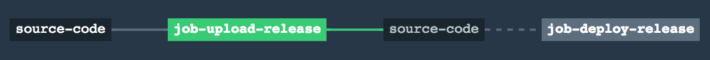

## Lab 4: Split upload and deploy into multiple jobs and add a trigger

#### Setup
* Open ci/tasks/upload-release.sh
* Edit the following environment variables with the values found in the supplied creds.yml or with the values supplied by your proctor.

  ```bash
  export CA_CERT_URL=<S3_object_URL>
  export BOSH_CLIENT_SECRET=<bosh password>
  export BOSH_DEPLOYMENT=<deployment name>
  export BOSH_DIRECTOR=<bosh director url>
  export BOSH_ENVIRONMENT=<bosh director ip>
  export BOSH_CLIENT=<bosh user>
  ```

* Open ci/tasks/deploy-relese.sh
* Edit the following environment variables with the values used above.

  ```bash
  export CA_CERT_URL=<S3_object_URL>
  export BOSH_CLIENT_SECRET=<bosh password>
  export BOSH_DEPLOYMENT=<deployment name>
  export BOSH_DIRECTOR=<bosh director url>
  export BOSH_ENVIRONMENT=<bosh director ip>
  export BOSH_CLIENT=<bosh user>
  ```

#### Activity
* Let's compare ci/lab3.yml to ci/lab4.yml and discuss the changes:

	```diff
	diff -U 100 ci/lab3.yml ci/lab4.yml
	--- ci/lab3.yml	2018-11-07 16:12:31.843846009 +0000
	+++ ci/lab4.yml	2018-11-13 17:16:57.382080122 +0000
	@@ -1,34 +1,41 @@
	 ---
	 jobs:
	 - name: job-upload-release
	   public: true
	   plan:
	   - get: source-code
	+    trigger: true
	     params: { depth: 1 }
	   - task: upload-release
	     config:
	       platform: linux
	       image_resource:
	         type: docker-image
	         source: {repository: starkandwayne/concourse}
	       run:
	         path: source-code/nginx_release/ci/tasks/upload-release.sh
	       inputs:
	         - name: source-code
	+- name: job-deploy-release
	+  public: true
	+  plan:
	+  - get: source-code
	+    passed: [job-upload-release]
	+    params: { depth: 1 }
	   - task: deploy-release
	     config:
	       platform: linux
	       image_resource:
	         type: docker-image
	         source: {repository: starkandwayne/concourse}
	       run:
	         path: source-code/nginx_release/ci/tasks/deploy-release.sh
	       inputs:
	         - name: source-code
	
	 resources:
	 - name: source-code
	   type: git
	   source:
	     uri: (( grab github.repository ))
	     branch: (( grab github.branch ))
	```

* Great, now we'll update our pipeline manifest with the lab4 changes. 

	```bash
	spruce merge --prune release  ci/settings.yml ci/lab4.yml > ci/pipeline.yml
	```

* Commit your release and push it back to Github
	```bash
	git commit -am 'split upload and deploy into multiple jobs'
	git push
	```

* Once again we set the pipeline 

	```bash
	fly -t training set-pipeline -c ci/pipeline.yml -p ${GITHUB_USERNAME}-pipeline
	```
	
Watch the Web-UI, within about a minute the trigger should pickup the changes applied to the git-repo and automatically process your pipeline. The result might look something like:



We've successfully triggered the first job `trigger: true`, and made the second a dependency on the first `passed: [job-upload-release]`, but the pipeline didn't run all the way through.

* Add a trigger for "job-deploy-release" and push your code change and update your pipeline as needed.

<details><summary>SOLUTION</summary>

* Great, now we'll update our pipeline manifest with the lab4 changes. 

	```bash
	spruce merge --prune release  ci/settings.yml ci/lab4a.yml > ci/pipeline.yml
	```

* Commit your release and push it back to Github
	```bash
	git commit -am 'split upload and deploy into multiple jobs'
	git push
	```

* Once again we set the pipeline 

	```bash
	fly -t training set-pipeline -c ci/pipeline.yml -p ${GITHUB_USERNAME}-pipeline
	```

</details>


Once this processes, and turns green you can move on to [Lab-5](lab-5.md).