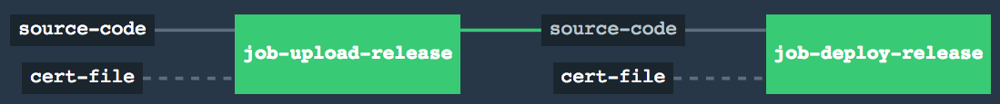

## Lab 5: Using a Certificate file with Concourse
* Open ci/tasks/upload-release-supplied-cert.sh
* Edit the following environment variables with the values found in the supplied creds.yml or with the values supplied by your proctor.

  ```bash
  export BOSH_CLIENT_SECRET=<bosh password>
  export BOSH_DEPLOYMENT=<deployment name>
  export BOSH_DIRECTOR=<bosh director url>
  export BOSH_ENVIRONMENT=<bosh director ip>
  export BOSH_CLIENT=<bosh user>
  ```

* Open ci/tasks/deploy-relese-supplied-cert.sh
* Edit the following environment variables with the values used above.

  ```bash
  export BOSH_CLIENT_SECRET=<bosh password>
  export BOSH_DEPLOYMENT=<deployment name>
  export BOSH_DIRECTOR=<bosh director url>
  export BOSH_ENVIRONMENT=<bosh director ip>
  export BOSH_CLIENT=<bosh user>
  ```
 
#### Activity
This time, we are going to supply the certificate from a remote resource. To do this, we are going to add a resource_type using an external library, that allows us to create a file from a remote resource. Let's look at how this changes the manifest:

```diff
diff -U 100 nginx_release/ci/lab4a.yml nginx_release/ci/lab5.yml
--- nginx_release/ci/lab4a.yml	2018-11-13 11:58:35.000000000 -0500
+++ nginx_release/ci/lab5.yml	2018-11-13 14:55:54.000000000 -0500
@@ -1,42 +1,58 @@
 ---
 jobs:
 - name: job-upload-release
   public: true
   plan:
   - get: source-code
     trigger: true
     params: { depth: 1 }
+  - get: cert-file
   - task: upload-release
     config:
       platform: linux
       image_resource:
         type: docker-image
         source: {repository: starkandwayne/concourse}
       run:
-        path: source-code/nginx_release/ci/tasks/upload-release.sh
+        path: source-code/nginx_release/ci/tasks/upload-release-supplied-cert.sh
       inputs:
         - name: source-code
+        - name: cert-file
 - name: job-deploy-release
   public: true
   plan:
   - get: source-code
     trigger: true
     passed: [job-upload-release]
     params: { depth: 1 }
+  - get: cert-file
   - task: deploy-release
     config:
       platform: linux
       image_resource:
         type: docker-image
         source: {repository: starkandwayne/concourse}
       run:
-        path: source-code/nginx_release/ci/tasks/deploy-release.sh
+        path: source-code/nginx_release/ci/tasks/deploy-release-supplied-cert.sh
       inputs:
         - name: source-code
+        - name: cert-file
+
+resource_types:
+  - name: file-url
+    type: docker-image
+    source:
+      repository: pivotalservices/concourse-curl-resource
+      tag: latest

 resources:
 - name: source-code
   type: git
   source:
     uri: (( grab github.repository ))
     branch: (( grab github.branch ))
+- name: cert-file
+  type: file-url
+  source:
+    url: https://unreal-snw.s3.amazonaws.com/training-bosh.pem
+    filename: training-bosh.pem
```

We can see how this is used in our script by comparing the old upload and deploy scripts with the new ones:

```diff
diff -U 100 ci/tasks/upload-release.sh ci/tasks/upload-release-supplied-cert.sh
8d7
--- ci/tasks/upload-release.sh	2018-11-08 16:33:03.000000000 -0500
+++ ci/tasks/upload-release-supplied-cert.sh	2018-11-08 18:06:05.000000000 -0500
@@ -1,22 +1,18 @@
 #!/usr/bin/env bash
 set -x
 #For the purpose of this tutorial, there are credentials being commited here.
 #This is on purpose and will be covered in the security tutorial.
 #The director is expected to be secured and only locally available for this lab session
 #But this does not demonostrate a best practice

-export CA_CERT_URL=https://unreal-snw.s3.amazonaws.com/training-bosh.pem
 export BOSH_CLIENT_SECRET=<replace-me>
 export BOSH_DEPLOYMENT=<replace-me-with-github-user>-nginx
 export BOSH_DIRECTOR='https://10.4.1.4:25555'
 export BOSH_ENVIRONMENT='training'
 export BOSH_CLIENT=admin

-cd source-code/nginx_release
-
-curl -LO ${CA_CERT_URL}
-bosh alias-env ${BOSH_ENVIRONMENT} --ca-cert training-bosh.pem -e ${BOSH_DIRECTOR}
-
+bosh alias-env ${BOSH_ENVIRONMENT} --ca-cert cert-file/training-bosh.pem -e ${BOSH_DIRECTOR}
 bosh login

+cd source-code/nginx_release
 bosh upload-release releases/release.gz
```

* Update the "resource_types/name:cert-file/source/url" in "ci/lab5.yml" to match the URL given by the proctor. This URL was previously being placed in the shell scripts as "CA_CERT_URL".

* Now let's go ahead and generate our pipeline manifest.
  
	```bash
	spruce merge --prune release  ci/settings.yml ci/lab5.yml > ci/pipeline.yml
	```


- Commit your release and push it back up to your Github fork

	```bash
	git commit -am 'updated release task'
	git push
	```

* Once again we set the pipeline 

	```bash
	fly -t training set-pipeline -c ci/pipeline.yml -p ${GITHUB_USERNAME}-pipeline
	```
	
You should have ended up with a pipeline that looks like:



The pipeline should automatically start when you push your code repo. When you are ready, you can move on to [Lab-6](lab-6.md)